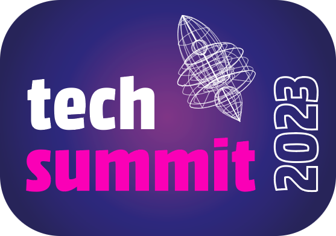

# 🚀 Coding Challenges ✨

👉 Copy [this template](https://github.com/heubeck/techsummit23-codingchallenges/generate) as (public) repository to your own GitHub profile 
👉 Solve as many challenges as you like, following their respective guide 
👉 Use _GitHub Codespaces_ to create, commit and push your solution 
👉 Submit your participation using **[this form](https://forms.office.com/e/0CenbaEQcp)** 

# Picture-Story Guide

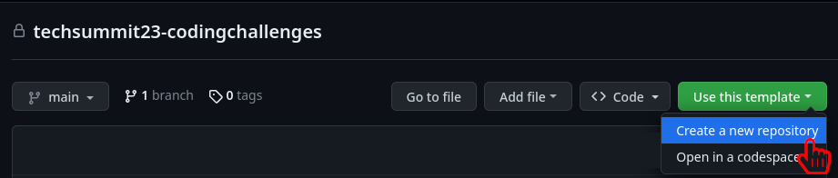

---

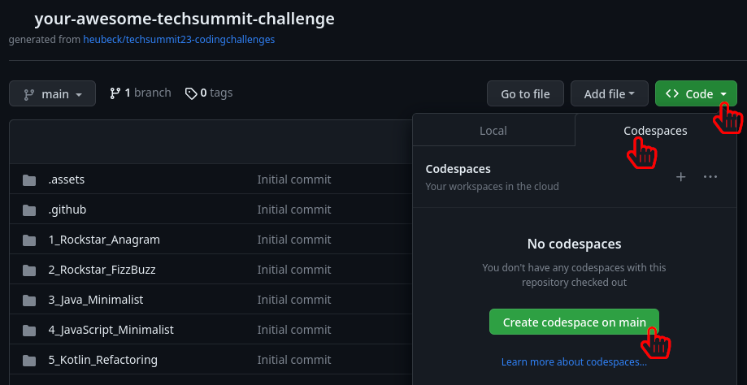

---

### `sdk install java 20-tem; sdk install jbang`
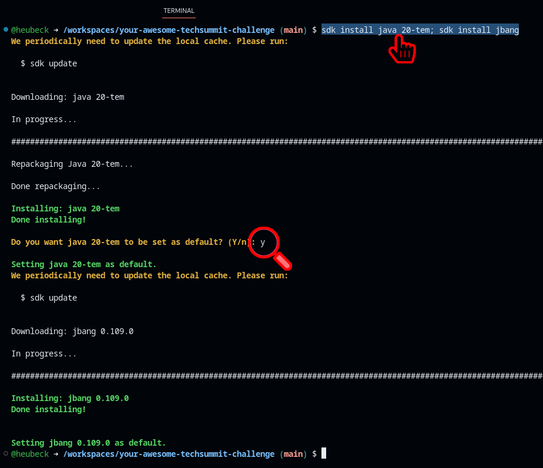

---

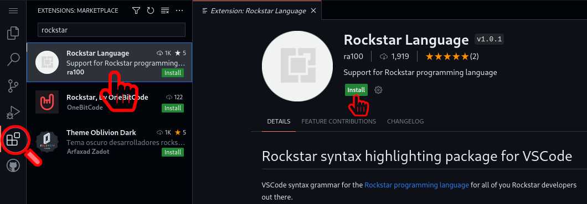

---

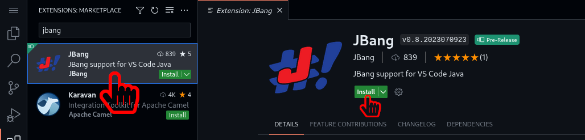

---

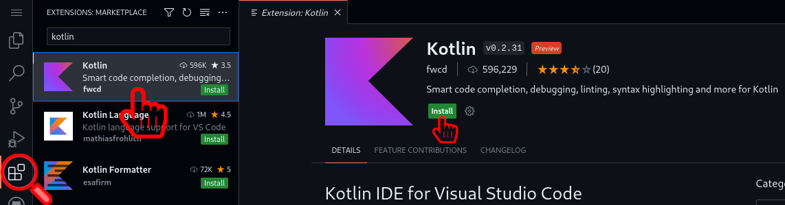

---

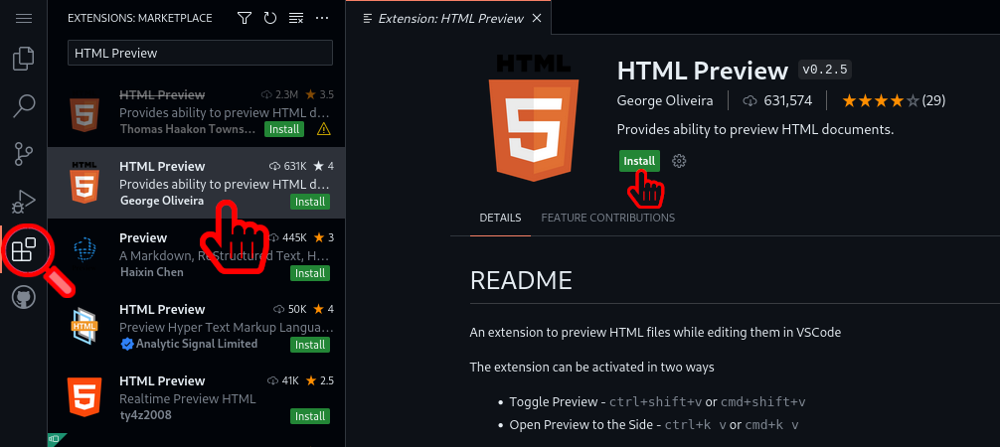

---

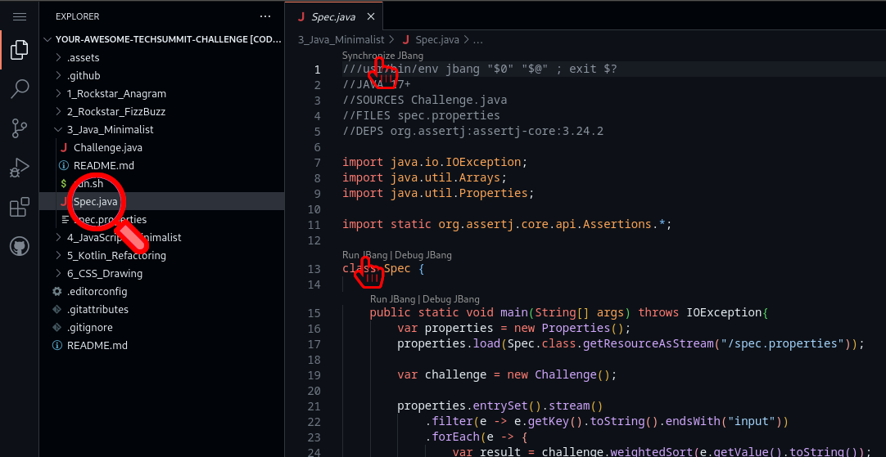

---

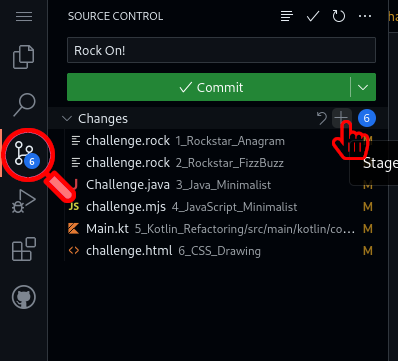

---

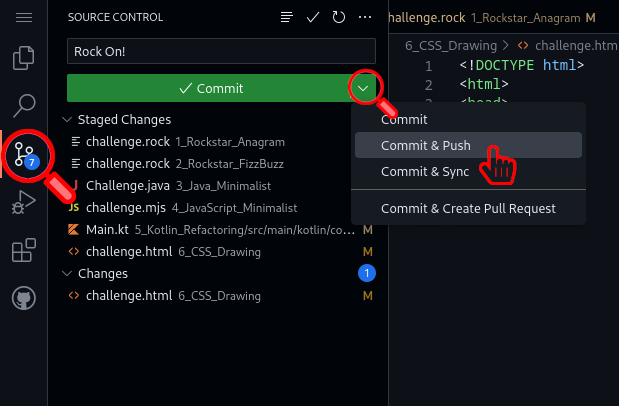

# Solution assessment

Each single coding challenge is rated as follows:

* 10 Points to the best solution
* 7 Points to the second best solution
* 5 Points to the third best solution
* 2 Points to every correct solution
* 1 Point for every reasonable try

**The sum of all challenges makes up the overall score for a participant.**

# Let's Go

## [#1 Rockstar Anagram](1_Rockstar_Anagram/)

## [#2 Rockstar FizzBuzz](2_Rockstar_FizzBuzz/)

## [#3 Java Minimalist](3_Java_Minimalist/)

## [#4 JavaScript Minimalist](4_JavaScript_Minimalist/)

## [#5 Kotlin Refactoring](5_Kotlin_Refactoring/)

## [#6 CSS Drawing](6_CSS_Drawing/)

## #7 Logo perception

_see participation submission form_
